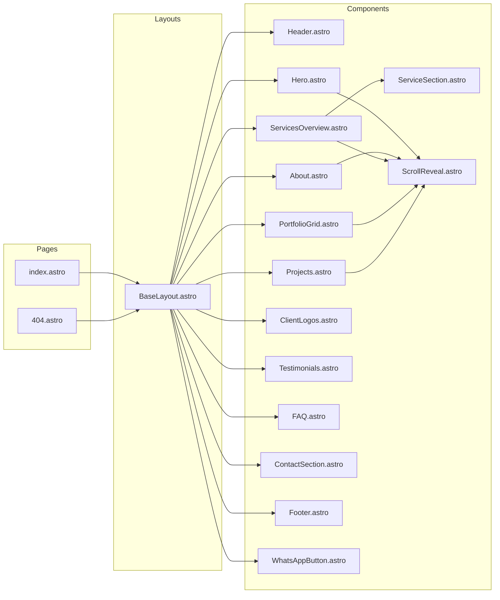
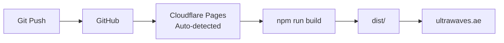
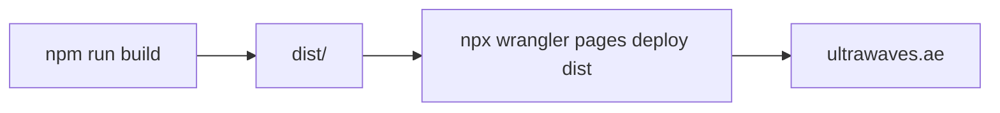

# Ultra Wave Technologies LLC — Company Website


A modern, static single-page company profile site for **Ultra Wave Technologies LLC** — a Dubai-based IT and networking solutions provider. Built with [Astro](https://astro.build), TypeScript, and Tailwind CSS, the site showcases the company's structured cabling, CCTV, IP telephony, Wi-Fi, access control, automation, and AMC services through a responsive, SEO-optimised experience.

---

## Table of Contents

- [✨ Features](#-features)
- [Tech Stack](#tech-stack)
- [Component Architecture](#component-architecture)
- [Getting Started](#getting-started)
- [Available Scripts](#available-scripts)
- [Project Structure](#project-structure)
- [Content Management](#content-management)
- [Deployment](#deployment)
- [Contributing](#contributing)
- [License](#license)

---

## ✨ Features

- **Single-page responsive design** — seamless experience across desktop, tablet, and mobile
- **Dark mode support** — automatic theme switching based on system preference
- **Scroll-triggered animations** — subtle reveal effects powered by `IntersectionObserver`
- **Interactive portfolio lightbox** — full-screen image gallery with keyboard navigation
- **Tabbed service categories** — browse 10 service offerings with dedicated detail sections
- **WhatsApp click-to-chat** — floating button with pre-filled message for instant contact
- **FAQ accordion** — expandable Q&A for common client queries
- **Testimonials carousel** — rotating client quotes with pagination
- **SEO-optimised** — semantic HTML, meta tags, and JSON-LD structured data for rich results
- **Auto-generated sitemap** — `@astrojs/sitemap` integration for search engine indexing
- **Type-safe content layer** — all copy, services, projects, and partners defined in typed TypeScript files
- **Fast builds** — Astro's static site generation with zero-JS output by default

---

## Tech Stack


The following diagram illustrates how the build pipeline transforms source code into a deployed static site:

```mermaid
flowchart TD
    A[User Browser] --> B[Cloudflare CDN]
    B --> C[Astro v6 Static Build]
    C --> D[dist/ ← Output Directory]

    subgraph Build_Time
        E[TypeScript *.ts] --> C
        F[Tailwind CSS v4] --> G[PostCSS] --> C
        H[Type-Safe Content<br/>src/content/*.ts] --> C
        I[Astro Components<br/>src/components/*.astro] --> C
    end

    subgraph Integrations
        J[@astrojs/sitemap] --> C
    end
```

| Layer        | Technology                          | Role                                    |
|-------------|-------------------------------------|-----------------------------------------|
| Framework   | [Astro](https://astro.build) v6     | Static site generation, routing, islands |
| Language    | [TypeScript](https://www.typescriptlang.org/) 5 (strict) | Type-safe logic and content definitions |
| Styling     | [Tailwind CSS](https://tailwindcss.com) v4 + [PostCSS](https://postcss.org/) | Utility-first CSS with pipeline processing |
| Runtime     | [Node.js](https://nodejs.org) >=22.12 | Development server and build toolchain   |
| Hosting     | [Cloudflare Pages](https://pages.cloudflare.com) | Global CDN deployment with zero config   |
| SEO         | `@astrojs/sitemap`                  | Automatic `sitemap.xml` generation       |

---

## Component Architecture

The site follows a flat component hierarchy with a single layout wrapping every page:



| Component           | Purpose                                    |
|---------------------|--------------------------------------------|
| `BaseLayout.astro`  | HTML shell, SEO meta, JSON-LD, font loading |
| `Header.astro`      | Sticky navigation bar with anchor links     |
| `Hero.astro`        | Full-viewport hero with tagline & CTA       |
| `About.astro`       | Company background, mission & values        |
| `ServicesOverview.astro` | Tabbed index of all 10 service categories |
| `ServiceSection.astro`   | Individual service detail panel          |
| `PortfolioGrid.astro`    | Image gallery with lightbox             |
| `Projects.astro`    | Case study cards with scope lists           |
| `ClientLogos.astro` | Partner brand showcase cards                |
| `Testimonials.astro`| Client quote carousel                       |
| `FAQ.astro`         | Accordion-style Q&A section                 |
| `ContactSection.astro`  | Contact form & company details          |
| `Footer.astro`      | Social links, copyright, back-to-top        |
| `ScrollReveal.astro`| `IntersectionObserver` wrapper for animations|
| `WhatsAppButton.astro` | Floating chat button with pre-filled message |

---

## Getting Started

### Prerequisites

- **Node.js** >= 22.12 (see `.nvmrc` or `.node-version` if available)
- **npm** (ships with Node.js)
- (Optional) **Wrangler CLI** for manual Cloudflare deployments

### Setup

```bash
# Clone the repository
git clone <repo-url>
cd ultrawaves-website

# Install dependencies
npm install

# Start the development server
npm run dev
```

Open [http://localhost:4321](http://localhost:4321) in your browser. The site supports hot-module replacement — edits to `src/` files appear instantly.

---

## Available Scripts

| Command             | Description                                      |
|---------------------|--------------------------------------------------|
| `npm run dev`       | Start the Astro dev server on port 4321           |
| `npm run build`     | Build the static site to the `dist/` directory    |
| `npm run preview`   | Preview the production build locally              |
| `npm run astro`     | Passthrough to the Astro CLI (`npx astro ...`)    |

---

## Project Structure

```
ultrawaves-website/
├── public/                  # Static assets served as-is
├── src/
│   ├── assets/web/          # Optimised images (logo, heroes, portfolio)
│   ├── components/          # Astro UI components (*.astro)
│   ├── content/             # Typed content data files (*.ts)
│   ├── layouts/             # Base layout with SEO + JSON-LD
│   ├── pages/               # Route pages (index.astro, 404.astro)
│   └── styles/              # Global CSS + Tailwind theme
├── astro.config.mjs         # Astro configuration
├── postcss.config.mjs       # PostCSS configuration (Tailwind)
├── tsconfig.json            # TypeScript strict config
├── wrangler.toml            # Cloudflare Pages deployment config
└── package.json
```

---

## Content Management

All site copy lives in typed TypeScript files under `src/content/`. No markup changes are needed to update text — just edit the relevant file:

| File                    | Content                                | Key Types                       |
|-------------------------|----------------------------------------|----------------------------------|
| `src/content/site.ts`   | Company info, tagline, nav links, social links, stats, about paragraphs, mission & values | `site`, `about`, `navLinks` |
| `src/content/services.ts` | 10 service definitions with descriptions, highlights, features & bullets | `Service[]`, `serviceOverview` |
| `src/content/portfolio.ts` | Portfolio gallery image captions     | `portfolioItems`                |
| `src/content/projects.ts` | Project case studies with titles, descriptions & scope items | `Project[]`               |
| `src/content/clients.ts` | Partner brand names and brand colours   | `partners`                      |
| `src/content/testimonials.ts` | Client testimonials (quotes, names, titles) | `Testimonial[]`           |
| `src/content/faq.ts`    | FAQ questions and answers               | `FAQ[]`                         |

Images are stored in `src/assets/web/` and referenced by path in the content files.

---

## Deployment

The site is deployed to **Cloudflare Pages** for global CDN delivery. Two methods are supported:

### Option A — Git Integration (recommended)



1. Push this repository to GitHub or GitLab.
2. In the **Cloudflare Dashboard**, navigate to **Workers & Pages → Create → Connect to Git**.
3. Select your repository and configure the build settings:
   - **Build command:** `npm run build`
   - **Build output directory:** `dist`
   - **Node version:** 22
4. Add a custom domain (e.g. `ultrawaves.ae`) under the Pages project settings.
5. Every subsequent push triggers an automatic rebuild and deploy.

### Option B — Wrangler CLI



```bash
npm run build
npx wrangler pages deploy dist --project-name=ultrawaves-website
```

> **Note:** The `wrangler.toml` file is pre-configured with `pages_build_output_dir = "dist"` and a matching compatibility date.

---

## Contributing

As this is a proprietary company website, external contributions are not expected. If you are an internal team member:

1. Fork or branch from `main`.
2. Make your changes — content edits go in `src/content/`, UI changes in `src/components/`.
3. Run `npm run build` to verify the build succeeds.
4. Open a pull request describing the changes.

---

## License

All Rights Reserved — © **Ultra Wave Technologies LLC**. This project is proprietary and not licensed for public use, modification, or distribution.
